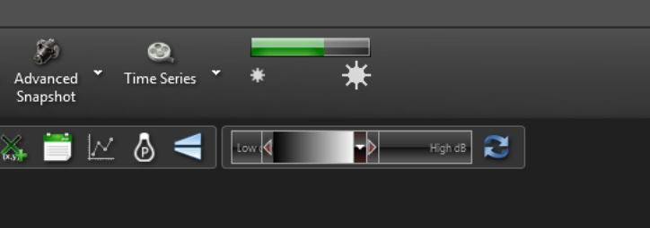

# OCT-data-processing
This repository contains a description of the OCT operating procedures, Python scripts for OCT data processing, software for OCT simulations, and an introduction to the research practicum (TN2952P).

# Quick manual OCT setup Ganymede II at ImPhys TUDelft

This manual gives a quick start guide for the OCT setup with the Thorlabs OCT software as well as some guidelines for storing data. The second half gives a brief introduction to the Python modules written to read the data and do some basic post processing into images.

For a more in depth description of the software we refer to the software and hardware manuals as given with the setup (see: C:\Program Files\Thorlabs\ThorImageOCT\Manual)

## Getting started
When the computer has started you can switch the power button on the base station and start the Thorlabs software. 

1 Set folder where your files will be saved to Go to File->settings and set both Dataset Folder and Export Folder to a personal folder. Preferably you make a subfolder in C:\OCTData\’your name’ and then possibly a subfolder named to the date or the experiment type.

2 Adjust reference arm intensity
In the 2D scan mode: tune the aperture in the reference arm until the reference intensity indicator (see figure) turns green. 
In the 1D mode: make sure there is no object within the field of view and tune the aperture until the maximum of the spectrum is around 70%. Then stop the scan and press the Calibrate Spectrum button.

3 Find the right position of the object
Open the 2D scan mode and start a scan. Put the objective lens about 5 cm or more above the object and then let it slowly approach the object until you see an image of the object appearing on the screen. The object should enter the domain from the bottom. 

4 Determine the focus of the objective lens
Place a flat object (for example the infrared detection card) below the objective lens and make sure it is visible in the image. Now tune the height of the objective until you have maximum intensity or even clipping of the signal. If the signal doesn’t clip, you probably have to adapt the reference arm length by turning the wheel on top of the reference arm. Then the image is axially shifted while the distance to the lens remains constant. You can use this to keep the object within the field of view and still vary the distance to the objective lens with more than 2 mm. In this way you can find the distance where you get the highest reflection intensity and this is the focal distance of the objective lens. 
With tuning the reference arm length, the position of the focus in the field of view can be adjusted. Once the reference arm length is fixed, the focus depth remains the same.

N.B. Putting a layer of water, glass or some other transparent material between the lens and the object will change the position of the focus in the image.

5 Saving datasets
A simple way to save dataset is pressing on the Snapshot button, which causes the raw data and/or the processed data to be saved in the folder you set in step 1. In the top right corner you see the name and number of the data file. In the case raw data is saved, the file also contains the reference spectrum. (For the 1D mode you should have pressed Calibrate Spectrum button before saving a snapshot.)

6	Load the data on your own computer in Matlab or Python
The snapshot data is saved as a .oct file, which is basically a zip file. You can extract the data from this using the Matlab scripts from Thorlabs (see C:\Program Files\Thorlabs\SpectralRadar\Matlab), the Python code as described below as well as by changing the file extension to .zip and then unzipping this zip file.

For more information go to the official manual at: C:\Program Files\Thorlabs\ThorImageOCT\Manual.

## Python modules
Two modules are written in python to read and process OCT data obtained with the Thorlabs software. 

1	ReadOCTfile: this module can be used to extract the raw data and metadata of the experiment from the .oct files.

2	DataProcessingOCT: this module contains functions for calculating A-scans and B-scans as well as extracting information like axial resolution and SNR from the data. It also contains functions to correct for dispersion.

The use of these modules is shown in the demos for 2D and 3D scans, for which a typical data file is included in the folder data. The file Chirp contains the chirp correction parameters for the spectrometer in the Ganymede II device. 

The python modules can be found at the QI group server: M:\tnw\ist\qi\users\jdewit\OCTsetup\Python_OCTprocessing as well as on the lab computer at: C:\OCTsoftware\Python_OCTprocessing

## Fun OCT facts
* use advanced snapshot for B-scans with proper timing at the linerate specified in the settings (snapshot is not well timed)
* disable B-scan size limit in the settings when you want to acquire more than 10000 A-lines in a B-scan.
