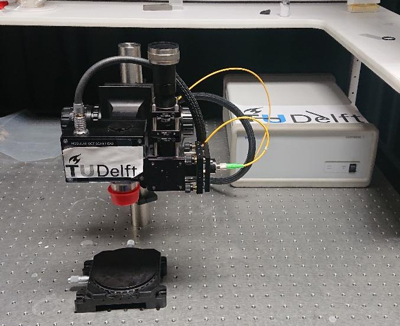

# Research practicum optical coherence tomography

Supervisor: Dr. Jeroen Kalkman, Department of Imaging Physics, room F262, j.kalkman@tudelft.nl

## Introduction
Welcome to the research practicum (RP) of the [KaLKMaNLaB](www.jkalkman.nl)! We focus on optical tomography. The goal of this RP is to quantitatively determine parameters of materials or fluids using [optical coherence tomography](https://en.wikipedia.org/wiki/Optical_coherence_tomography) (OCT). OCT is an interferometric imaging technique that can image deep in tissue. You can think of OCT as the optical equivalent of ultrasound. However, in OCT the speed of light is much higher than the speed of sound. Hence, you cannot determine the time-of-flight (the time it takes for the reflected light to return) using electronic means. So in OCT this is done with interferometry. With a broad bandwidth light source interference only occurs close to a reflector. By measuring the interference spectrum and performing a Fourier transform the reflectivity as a function of depth can be determined. 

OCT was [invented](http://10.1126/science.1957169) in 1991 for structural imaging of tissue. Since then there has been a long development in obtaining quantitative parameters from OCT. Here we mention a few of the most relevant ones for our set up

* Doppler OCT: based on the Doppler shift of light scattered by flowing particles, fluid flow can be quantitatively measured and imaged. 
* Dynamic light scattering OCT: measurement of the light scattering fluctuations. These fluctuations can be analyzed using statistical analysis from which particle diffusion or flow can be determined.  
* OCT elastography: OCT imaging of sample deformation to estimate mechanical parameters such as Poisson's ratio, shear modulus

The goal of this RP is that you use research skills such that can initiate scientific research with advanced instrumentation and data analysis to answer a scientific question. You can come up with your own scientific question as long as it is related to fluid or structural dynamics that can be measured with the OCT system.

## The research project

### The OCT system

For this RP you will use the [Ganymede](https://www.thorlabs.com/newgrouppage9.cfm?objectgroup_id=8214) system from Thorlabs, see the picture on the right. This is a spectral-domain OCT system with 3 micrometer axial resolution and an imaging depth of 1.9 mm. It has a superluminescent diode that creates a spectrum centered at 900 nm with a 220 nm bandwidth. The light is detected on a spectrometer that operates at 36 kHz. More details can be found in several [papers](https://doi.org/10.1364/OE.439761). The system is operated through [Thorimage](https://www.thorlabs.com/newgrouppage9.cfm?objectgroup_id=7982) software. With that software you can output the data to the `.oct` format that you later analyze.

### Getting started

1. Download the material from the Gitlab [https://github.com/KaLKMaNLaB/optical-coherence-tomography](Github) repository.
2. Read the `readme.md` file and perform your measurements.
3. Login to the OCT computer with your netid and password.
4. Turn on the OCT system 
5. Goto to `C:\Program Files\Thorlabs\ThorImageOCT.exe` and open the executable. 
6. You are ready to go.

### Possible research directions
Here we give a few research directions that are possible

**Flow analysis**

With the Doppler mode of the OCT system you can quantitatively determine the flow of a suspension (particles in a fluid). The particles are required for the light to backscatter. OCT measures the axial flow component (in the direction of the light), the perpendicular flow component is not accessible. The flow can be measured with the beam at a fixed location (so-called M-mode scanning), but also  during lateral scanning (so-called B-mode scanning), in the latter case you get a 2D flow scan, but you need to sufficiently sample. For an impression of the laminar flow profiles that can be measured see the paper of [Kalkman et al.](https://doi.org/10.1364/OE.18.003883). As a suggestion you could look at non-Newtonian flow, study the effect of lateral scanning on the measured flow profile, and/or investigate the effect of phase wrapping. 

**Diffusion analysis**

We developed a technique for [diffusion analysis and imaging](https://doi.org/10.1103/PhysRevLett.105.198302) that is utilized to quantify the diffusion coefficient of particles in a fluid. This is done using a statistical analysis on the data called the autocorrelation that looks at how similar a signal is to itself when you shift it. The autocorrelation is fitted using function from which the diffusion coefficient can be determined. From the diffusion coefficient and the [Stokes-Einstein](https://en.wikipedia.org/wiki/Einstein_relation_(kinetic_theory)) relation you can access the particle radius, the viscosity, or the temperature. As a suggestion you could investigate the particle size(s) in fluids (such as milk) or study the effect of viscosity on the diffusion.

**Structural analysis**

OCT can measure the structure of samples as it quantitatively measures the depth at which reflectors are located. The OCT depth is associated with optical path length, this is the product of refractive index and physical path length. Structural imaging requires you to analyze the images and automatically determine interfaces. The structural images can be performed over time to study dynamic processes. As a suggestion you could look at the drying process of a (milk) drop, determine elastic properties during mechanical loading (e.g., compression), or study the refractive index of solutions. 

 
**Any other idea**

It is also much appreciated that you come up with you own research idea. You can discuss it with your supervisor to see whether it is feasible. 

### Analyzing the data
The data you acquire with the OCT software is stored in a `.oct` file format. These files can be analyzed using Python `.py` files that are available to you via the [Git](https://github.tudelft.nl/jeroenkalkman/optical-coherence-tomography.git) repository. Familiarize yourself with the basic processing steps that are being performed, but get lost in all the details. Use the scripts to perform the basic processing and subsequently make your own code to perform the processing that you require.

Also in the repository there is a `readme.md` file that gets you started with the Thorimage software and the measurements. 

## Preparing for your RP
To do this RP you need basic knowledge of Fourier transforms. Knowledge about Signals and Systems is a bonus, but not required. 

To perform your RP you need to do the following 

- Do the online laser safety test. You will receive a link to the test after registration by the management assistant.
- Read the popular article on OCT in the [NTvN](https://homepage.tudelft.nl/7x60g/pdfs/KalkmanOCTNTvN2015.pdf)  
- Read the lecture material on OCT from [Kalkman](https://qiweb.tudelft.nl/aoi/opticalcoherencetomography/opticalcoherencetomography.html) or [Izatt](https://link.springer.com/content/pdf/10.1007%2F978-3-319-06419-2_3.pdf). This provides the basic mathematics of Fourier-domain OCT. The part on time-domain OCT is less relevant.

## Reporting about your RP
Please write your research report according to the rules and guidelines set out in the Manual RP report that you can find in Brightspace (Brightspace -> Verslag). The goal of a research report is to register your method and results in such a way that someone else can redo the experiment and appreciate the significance and trustworthiness of the results. A good report is well structured. This may of course be quite different from how the experiment was performed! Below is a bit more info specific to this project.

- Introduction: briefly introduce the topic (1-2 pages). Think about it as a funnel, go from the broad motivation for the topic to the specific research you are doing and the relation to that higher goal. Try to phrase a clear research question that you want to address (this can be different from your initial question).   
- Theory: give a brief overview (1-2 pages) of the theory required to understand your experiments and analysis. Do not summarize entire stretches of OCT theory (just add a reference instead).
- Methods and materials: Give an overview of the things that you used to achieve the obtained results. You can make subdivisions like: OCT system, sample preparation, analysis process. Aid the reader by structuring your methods by providing diagrams (for processing), illustrations (of the experimental geometry), and/or tables (for materials).
- Results: present the results in good quality graphs (labels, legend, error bars, etc.). Show exemplary data for import processing steps, e.g., a single flow profile with fit followed by measurements for total flow for varying discharge. Write the characteristics of every plot and discuss the quality.   
- Discussion: indicate what is obtained according to your expectation and what not. Refer to the literature for a comparison if necessary. Discuss the possible reasons for any discrepancy between the expectations and the measurements. Discuss what could be improved in the future. 
- Conclusions: a brief summary (half a page maximum) of the main conclusions. 
- Appendix: put here the code of your analysis scripts or important raw data  
